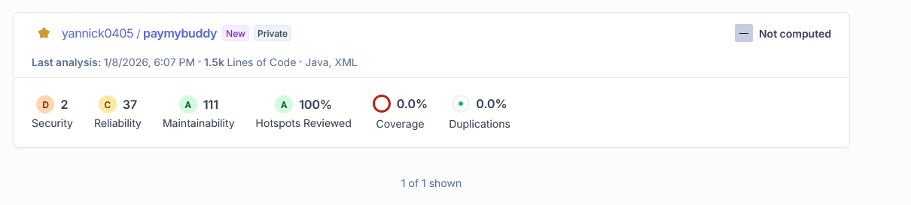
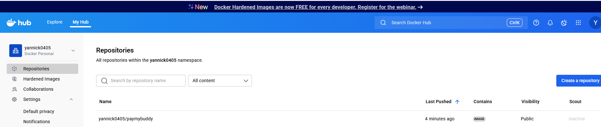
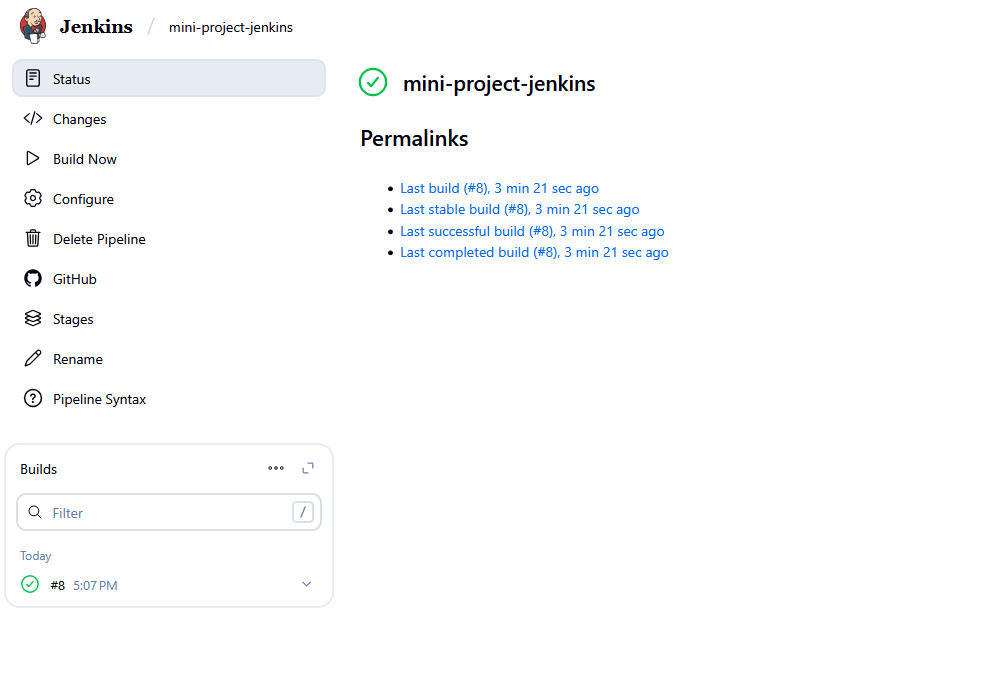


# Projet PayMyBuddy - Pipeline CI/CD

Ce projet implémente une chaîne de livraison continue (CI/CD) automatisée pour l'application **PayMyBuddy**, basée sur Spring Boot.

## 🛠 Architecture & Outils

L'automatisation est orchestrée par **Jenkins** et repose sur les outils suivants :

-   **Gestion de version :** Git & GitHub (Multi-repo : Pipeline & Application).
    
-   **Build & Tests :** Maven 3.9 (exécuté via un conteneur Docker pour garantir la portabilité).
    
-   **Qualité du code :** Analyse statique via **SonarCloud**.
    
-   **Conteneurisation :** Docker (Image poussée sur DockerHub).
    
-   **Déploiement :** Automatisé via SSH sur des instances AWS (Staging & Production).
    

## 📋 Pipeline Stages

Le `Jenkinsfile` est structuré en plusieurs étapes clés :

1.  **Checkout Source :** Récupération du code de l'application depuis le dépôt GitHub.
    
2.  **Tests & SonarCloud :** Exécution des tests unitaires et envoi du rapport d'analyse à SonarCloud (Project & Org Key: `yannick0405`).
    
3.  **Build & Push Docker :** Compilation du JAR, création de l'image Docker taguée avec le numéro de build, et push sur DockerHub (`yannick0405/paymybuddy`).
    
4.  **Deploy Staging :** Déploiement automatique sur l'instance Staging via SSH.
    
5.  **Deploy Production :** Déploiement sur l'instance de Production avec approbation manuelle.
    

## ⚙️ Configuration requise (Credentials)

Pour fonctionner, le pipeline utilise les credentials Jenkins suivants :

-   `yann` : Identifiants DockerHub (Username: `yannick0405`).
    
-   `sonar-token` : Token d'authentification SonarCloud.
    
-   `SSH_AUTH_SERVER` : Clé privée pour l'accès aux instances AWS.
    
-   `slack-token` : Token pour les notifications de statut du build.
    

## 🚀 État actuel

-   **Analyse SonarCloud :** Validée et réussie (Status: SUCCESS).
    
-   **Artifacts Docker :** Image disponible sur DockerHub.
    
-   **Infrastructure :** Les scripts de déploiement sont opérationnels.
    

    > _Note : L'exécution finale du déploiement nécessite la présence du moteur Docker sur les instances cibles pour l'interprétation des commandes `docker pull` et `run`._
> En raison du temps limité (2 heures) sur la plateforme DockerLabs d’Eazytraining, les notifications Slack n’ont pas été activées. Ainsi, aucune capture d’écran n’a pu être réalisée lorsque le pipeline est passé au vert. La configuration et le code ont néanmoins été correctement mis en place.
